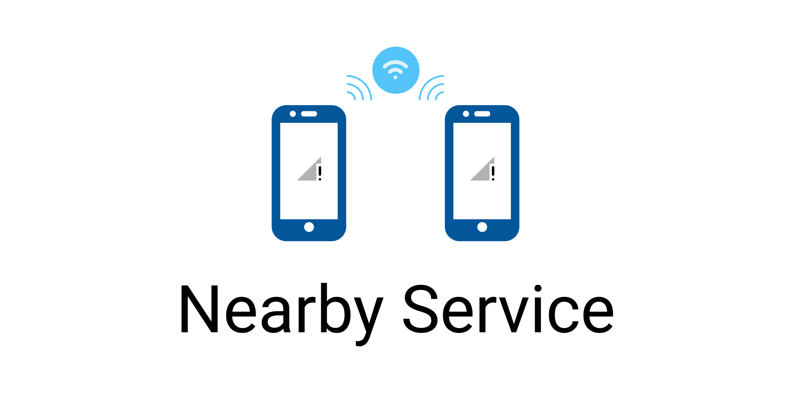

# Nearby Service
#### Connecting phones in a P2P network

Nearby Service Flutter Plugin is used to create connections in a P2P network. With this plugin you can easily create any
kind of information sharing application **without Internet connection**.

